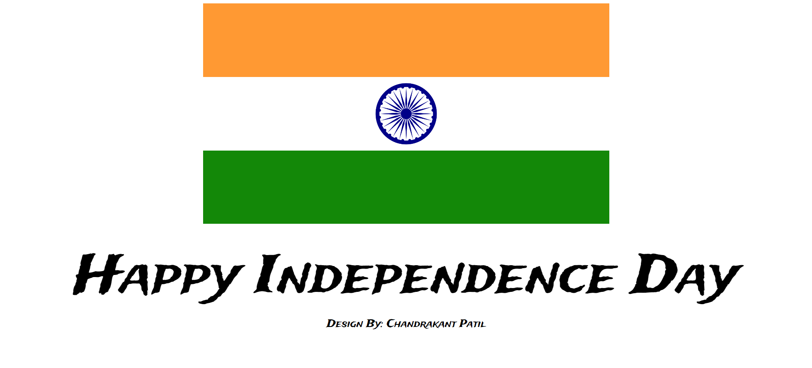

# Indian Flag Independence Day Project

## Project Overview

This project is a simple HTML and CSS implementation of the Indian flag with a message for Independence Day. It demonstrates the flag's design using HTML and CSS, and includes a celebratory message to honor India's Independence Day.

## Features

- **Indian Flag Design**: An accurate representation of the Indian flag using HTML and CSS.
- **Independence Day Message**: A message displayed alongside the flag to celebrate Independence Day.

## Installation

To view the project locally, follow these steps:

1. **Clone the Repository**

   ```bash
   git clone https://github.com/theckpatil/independence-day.git
   ```

2. **Navigate to the Project Directory**

   ```bash
   cd independence-day
   ```

3. **Open the `index.html` File**

   You can open the `index.html` file in your web browser to view the project.

## Usage

1. **Open in Browser**: Double-click on the `index.html` file or right-click and select "Open with" and choose your preferred web browser.
2. **View the Flag and Message**: You should see the Indian flag along with the Independence Day message.

## Screenshot

Here is a screenshot of the project:




## Contributing

Feel free to contribute to this project by opening issues or submitting pull requests. Please ensure that your contributions adhere to the project's coding standards and guidelines.

## License

This project is licensed under the MIT License. See the [LICENSE](LICENSE) file for details.
